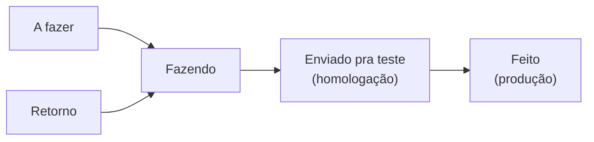

## Os ambientes

| Ambiente | Para quê | Quem valida |
| --- | --- | --- |
| **Desenvolvimento** | Máquina do dev, com `runserver` e `vite dev` | O próprio dev |
| **Homologação** | Validação manual antes de produção — etapa *Enviado pra teste* no board | Desenvolvedor responsável |
| **Produção** | Ambiente usado pelos clientes — etapa *Feito* no board | Time Miggo |

## Domínios de produção

Extraídos dos rótulos Traefik nos arquivos de compose e das referências no código:

| Serviço | Domínio |
| --- | --- |
| Frontend | `plataforma.miggomkt.com.br` |
| API | `api.miggomkt.com.br` |
| MiggoAI | `ai.miggomkt.com.br` |
| Documentação de produto | `docs.miggomkt.com.br` |
| Site institucional | `miggomkt.com.br` |

## Infraestrutura

Os dois serviços são publicados com **Docker Compose atrás do Traefik**, usando a rede externa `root_default` e certificados Let's Encrypt (`certresolver=letsencrypt`, entrypoint `websecure`).

<Tabs>
  <Tab title="Backend">
    `backend-miggo/docker-compose.yml` define dois serviços:

    - `miggo-db` — imagem `postgres:16`, porta `5432`.
    - `miggo-api` — build do `dockerfile` local, porta interna `8000`, volumes `./static_data:/app/static` e `./media_data:/app/media`.

    O roteador Traefik aplica dois middlewares: `miggo-headers`, que injeta `X-Forwarded-Proto: https` e `X-Forwarded-Ssl: on`, e `miggo-buffering`, que eleva `maxRequestBodyBytes` para 104857600 (100 MB) — o mesmo valor de `FILE_UPLOAD_MAX_MEMORY_SIZE` e `DATA_UPLOAD_MAX_MEMORY_SIZE` passados ao container, para suportar upload de mídia.
  </Tab>
  <Tab title="Frontend">
    `frontend-miggo/docker-compose.yml` define `miggo-frontend`: build local com os *build args* `VITE_MIGGO_API_KEY` e `VITE_API_BASE_URL`, `env_file: .env`, e Nginx servindo na porta interna `80`.

    <Note>
      Variáveis `VITE_*` são resolvidas **em tempo de build**, por isso entram como build args. Mudar o `.env` sem rebuildar a imagem não altera o bundle. Veja [Build e deploy do frontend](/frontend/build-e-deploy).
    </Note>
  </Tab>
  <Tab title="MiggoAI">
    O repositório traz `Dockerfile.backend` e `Dockerfile.frontend`, com Nginx para o frontend. Detalhes em [Deploy do MiggoAI](/miggoai/deploy).
  </Tab>
</Tabs>

<Warning>
  O `docker-compose.yml` do backend contém credenciais de banco em texto puro no arquivo versionado. Para qualquer ambiente real, mova esses valores para variáveis de ambiente ou para um `.env` não versionado.
</Warning>

## Diferenças de configuração por ambiente

Estas variáveis costumam mudar entre ambientes (todas descritas em [Configuração do backend](/backend/configuracao)):

| Variável | Desenvolvimento | Produção |
| --- | --- | --- |
| `DEBUG` | `True` | `False` |
| `ALLOWED_HOSTS` | `localhost,127.0.0.1` | domínios reais |
| `CORS_ALLOWED_ORIGINS` / `CSRF_TRUSTED_ORIGINS` | origem local do Vite | domínio do frontend |
| `SECURE_SSL_REDIRECT` | desligado | ligado |
| `CSRF_COOKIE_DOMAIN` | vazio | domínio da plataforma |
| `USE_S3` | normalmente desligado (mídia local) | ligado, com as `AWS_*` |
| `STRIPE_API_KEY` vs `STRIPE_PROD_API_KEY` | chave de teste | chave de produção |
| `MIGGOAI_API_URL` | instância local (`http://localhost:10000` é o padrão do cliente) | `ai.miggomkt.com.br` |
| `LOG_FILE` | vazio (só terminal) | caminho de arquivo |

## Fluxo de promoção de uma mudança

O board do Jira (projeto **MIG**) espelha o caminho de uma alteração:

<Note>
  *Enviado pra teste* significa **homologado manualmente pelo desenvolvedor**; *Feito* significa **em produção**. As duas últimas transições são responsabilidade humana.
</Note>

## Relacionados

<Columns cols={3}>
  <Card title="Deploy do backend" icon="server" href="/backend/deploy" />
  <Card title="Deploy do frontend" icon="monitor" href="/frontend/build-e-deploy" />
  <Card title="Deploy do MiggoAI" icon="sparkles" href="/miggoai/deploy" />
</Columns>
