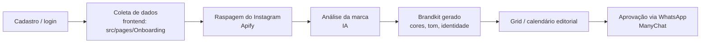
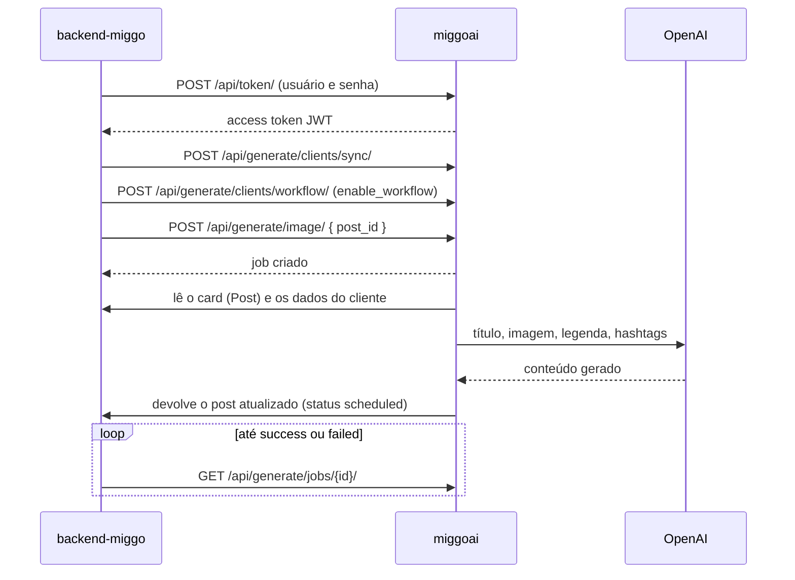
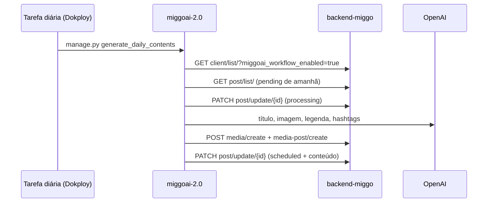
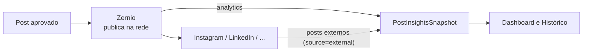
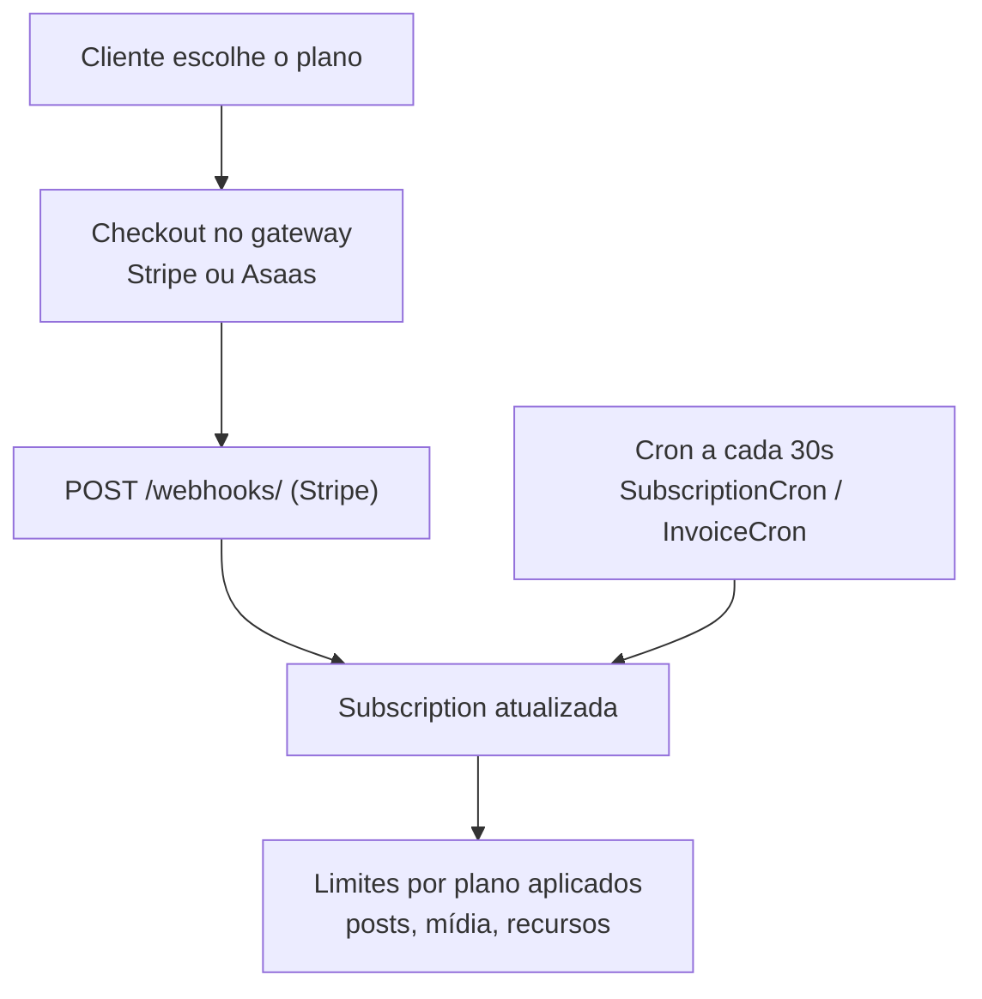

Cinco fluxos explicam a maior parte do sistema. Cada etapa aponta para a página que detalha o código envolvido.

## 1. Onboarding do cliente

É o fluxo mais pesado do backend (`app/onboarding`, o maior app do projeto). Ele transforma um cadastro em um cliente com marca definida e calendário editorial pronto.

- **Frontend**: passos em `src/pages/Onboarding/Steps/`, orquestrados pelo hook `useOnboarding` e pelo service `onboardingApi.ts`. Veja [Onboarding no frontend](/frontend/onboarding).
- **Backend**: `app/onboarding/` (services, cron, clientes de API). Veja [Onboarding no backend](/backend/apps/onboarding).
- **Limites configuráveis**: `ONBOARDING_IG_MIN_POSTS` (mínimo de posts para analisar o perfil), `ONBOARDING_WEBSITE_BUDGET` (orçamento de leitura do site), `ONBOARDING_ANALYSIS_STALL` (detecção de análise travada).

## 2. Geração de conteúdo pelo MiggoAI

O card nasce com status `pending` e volta como `scheduled`. Cliente da integração: `app/onboarding/miggoai.py`; workflows do lado da IA: [Workflows](/miggoai/workflows).

<Warning>
  O worker do MiggoAI **ignora clientes sem `enable_workflow=True`**. Se a geração "não acontece" para um cliente específico, essa flag é o primeiro lugar a checar.
</Warning>

### Geração diária no MiggoAI 2.0

No `miggoai-2.0` a geração automática roda por um management command diário, sem worker nem `enable_workflow`. Quem decide se o cliente entra é a flag `Client.miggoai_workflow_enabled` do `backend-miggo`, ligada pelo admin em **Predefinições de Criação de Conteúdo**.

Falha em qualquer passo devolve o card para `pending`. Detalhes em [Workflows](/miggoai/workflows).

## 3. Aprovação de conteúdo pelo WhatsApp

O cliente aprova ou pede ajuste no conteúdo por WhatsApp, através do ManyChat. O backend mantém a máquina de estados em `ConversationFlowState` e usa o **Dynamic Block**: a URL registrada no ManyChat é fixa, e o que será renderizado é decidido pelo estado do fluxo, nunca por parâmetro de URL.

| Peça | Onde fica |
| --- | --- |
| Engine do fluxo | `app/conversation/` — veja [Conversation](/backend/apps/conversation) |
| Webhook de entrada | `POST /webhooks/manychat/` |
| Continuação do Dynamic Block | `POST /webhooks/manychat/dynamic-block/continue/` |
| Flows configurados | `CONTENT_APPROVATION_FLOW_ID` (rede não conectada), `CONTENT_APPROVATION_CONNECTED_FLOW_ID` (rede conectada), `GRID_APPROVAL_FLOW_ID`, `DYNAMIC_FLOW_STARTER_FLOW_ID` |
| Escolha do flow de aprovação | `app.post.services.approval_flow_ns` — pela integração ativa da rede do post (antes era uma tag no ManyChat) |
| Reenvio e tolerância a falha | `WHATSAPP_FLOW_RETRY_ATTEMPTS`, `WHATSAPP_FLOW_RETRY_BACKOFF`, `WHATSAPP_SEND_FLOW_DELAY`, `GRID_APPROVAL_MAX_REMINDERS` |

Revisões agendadas são despachadas pelo cron `app.post.cron.send_scheduled_reviews`, que roda a cada minuto.

## 4. Publicação e métricas

A publicação nas redes e a coleta de métricas passam pelo **Zernio**. O backend guarda o histórico localmente em `PostInsightsSnapshot`, de modo que o painel não dependa de disponibilidade do provedor.

O Zernio também notifica a conexão de contas em `POST /webhooks/zernio/account/`. Detalhes em [Post](/backend/apps/post) e [Webhooks](/backend/apps/webhooks).

## 5. Assinatura e cobrança

- Gateways: `app/subscription/` (Stripe) e `app/subscription/asaas_gateway.py` (Asaas).
- Período de teste e carência: `STRIPE_TRIAL_DAYS`, `BILLING_GRACE_DAYS`.
- Limites durante o teste: `TRIAL_MEDIA_MAX_FILES`, além dos limites por plano.
- Verificação periódica: `app.subscription.cron.SubscriptionCron.check_subscriptions` e `app.subscription.cron.InvoiceCron.check_invoices`, ambos a cada 30 segundos no runner local.

Detalhes em [Subscription](/backend/apps/subscription) e [Tarefas agendadas](/backend/tarefas-agendadas).

## Relacionados

<Columns cols={2}>
  <Card title="Visão geral" icon="network" href="/arquitetura/visao-geral">
    Quem é quem na arquitetura.
  </Card>
  <Card title="Integrações externas" icon="share-2" href="/arquitetura/integracoes-externas">
    O papel de cada provedor citado aqui.
  </Card>
</Columns>
