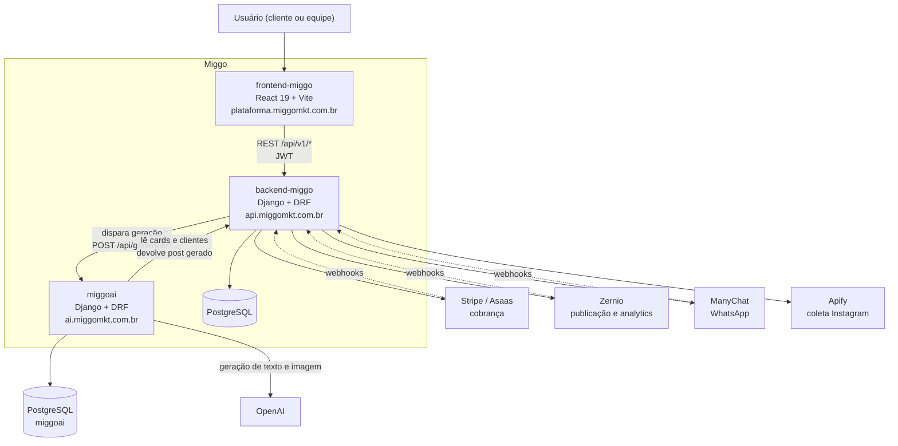

A plataforma Miggo é composta por três aplicações independentes, cada uma em seu próprio repositório, que se comunicam por HTTP.

## Responsabilidade de cada serviço

<Columns cols={3}>
  <Card title="backend-miggo" icon="server" href="/backend/instalacao">
    Fonte da verdade do domínio. Guarda contas, clientes, marcas, posts, calendário editorial, mídia, assinaturas e histórico. Expõe a API `/api/v1/*` consumida pelo frontend, recebe os webhooks dos provedores externos e orquestra a geração de conteúdo no MiggoAI.
  </Card>
  <Card title="frontend-miggo" icon="monitor" href="/frontend/instalacao">
    Única interface do produto. Não tem banco nem estado de servidor: tudo vem da API do backend. Divide-se em duas áreas por papel — `/app` para o cliente e `/admin` para a equipe Miggo.
  </Card>
  <Card title="miggoai" icon="sparkles" href="/miggoai/instalacao">
    Serviço de geração por IA. Mantém prompts versionados e workflows que produzem título, imagem, legenda e hashtags. Lê clientes e cards do backend principal e devolve o post pronto.
  </Card>
</Columns>

## Contrato entre backend e MiggoAI

O backend é quem inicia a conversa. O cliente dessa integração vive em `app/onboarding/miggoai.py` e o fluxo documentado no próprio arquivo é:

<Steps>
  <Step title="Autenticação">
    `POST /api/token/` com usuário e senha (`MIGGOAI_USERNAME` / `MIGGOAI_PASSWORD`) devolve um access token JWT.
  </Step>
  <Step title="Sincronização do cliente">
    `POST /api/generate/clients/sync/` sincroniza a lista de clientes da Miggo e `POST /api/generate/clients/workflow/` habilita `enable_workflow` — sem essa flag o worker do MiggoAI ignora o cliente.
  </Step>
  <Step title="Disparo da geração">
    `POST /api/generate/image/` com o `post_id` cria um job de geração para o card.
  </Step>
  <Step title="Acompanhamento">
    `GET /api/generate/jobs/{id}/` é consultado até o job terminar em `success` ou `failed`. O card sai de `pending` e volta como `scheduled`.
  </Step>
</Steps>

<Note>
  Toda chamada ao MiggoAI é auditada na tabela `Integration` do backend (função `_audit` em `app/onboarding/miggoai.py`). A auditoria é *best-effort*: uma falha ao registrar nunca derruba o fluxo real. Veja [app integration](/backend/apps/integration).
</Note>

## Contrato entre frontend e backend

O frontend autentica por JWT obtido nas URLs configuradas em `VITE_JWT_OBTAIN_URL` e `VITE_JWT_REFRESH_URL`, e envia a chave `VITE_MIGGO_API_KEY` nas requisições. Todos os recursos ficam sob o prefixo `/api/v1/`, um segmento por app do backend:

| Prefixo | App | Documentação |
| --- | --- | --- |
| `/api/v1/account/` | `app.account` | [Account](/backend/apps/account) |
| `/api/v1/client/` | `app.client` | [Client](/backend/apps/client) |
| `/api/v1/post/` | `app.post` | [Post](/backend/apps/post) |
| `/api/v1/integration/` | `app.integration` | [Integration](/backend/apps/integration) |
| `/api/v1/editorial-calendar/` | `app.editorial_calendar` | [Editorial Calendar](/backend/apps/editorial-calendar) |
| `/api/v1/media/` | `app.media` | [Media](/backend/apps/media) |
| `/api/v1/history/` | `app.history` | [History](/backend/apps/history) |
| `/api/v1/subscription/` | `app.subscription` | [Subscription](/backend/apps/subscription) |
| `/api/v1/brandkit/` | `app.brandkit` | [Brandkit](/backend/apps/brandkit) |
| `/api/v1/agenda/` | `app.agenda` | [Agenda](/backend/apps/agenda) |
| `/api/v1/notification/` | `app.notification` | [Notification](/backend/apps/notification) |
| `/api/v1/onboarding/` | `app.onboarding` | [Onboarding](/backend/apps/onboarding) |
| `/api/v1/conversation/` | `app.conversation` | [Conversation](/backend/apps/conversation) |
| `/api/v1/email-marketing/` | `app.emailmarketing` | [E-mail marketing](/backend/apps/emailmarketing) |

Fonte: `core/urls.py`.

## Webhooks de entrada

Além da API versionada, o backend expõe rotas de webhook fora do prefixo `/api/v1/` (também em `core/urls.py`):

| Rota | Origem | Handler |
| --- | --- | --- |
| `/webhooks/` | Stripe | `app.webhooks.views.webhook_stripe` |
| `/webhooks/zernio/account/` | Zernio | `app.webhooks.views.webhook_zernio_account` |
| `/webhooks/manychat/` | ManyChat | `app.conversation.webhooks.webhook_manychat` |
| `/webhooks/manychat/dynamic-block/continue/` | ManyChat (Dynamic Block) | `app.conversation.webhooks.manychat_dynamic_block_continue` |

<Note>
  A URL do Dynamic Block é fixa: o que será renderizado vem do `ConversationFlowState`, nunca de um parâmetro na URL. Detalhes em [Conversation](/backend/apps/conversation).
</Note>

## Próximos passos

<Columns cols={2}>
  <Card title="Fluxos principais" icon="git-branch" href="/arquitetura/fluxos">
    Onboarding, geração de conteúdo, aprovação, publicação e cobrança, ponta a ponta.
  </Card>
  <Card title="Integrações externas" icon="share-2" href="/arquitetura/integracoes-externas">
    O papel de cada provedor e onde o código de integração vive.
  </Card>
</Columns>
