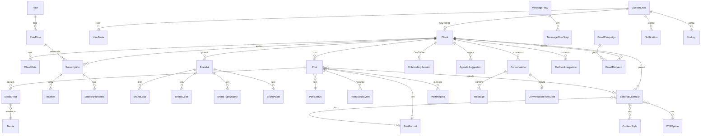

Esta página lista, para cada app, os models com seus campos principais e relacionamentos. Todos os `id` são `BigAutoField` implícitos (`DEFAULT_AUTO_FIELD`, `core/settings.py:379`), omitidos das tabelas.

## Diagrama de entidades centrais

## account

### `CustomUser` — `app/account/models.py:26`
Ver detalhes completos em [Autenticação](/backend/autenticacao).

| Campo | Tipo | Relacionamento |
|---|---|---|
| `hash` | `CharField(64)`, único | |
| `email` | `EmailField`, único | |
| `name`, `phone` | `CharField` | |
| `role` | `CharField(50)`, default `client` | texto livre (`admin`/`manager`/`client` por convenção) |
| `is_staff`, `is_active`, `email_verified` | `BooleanField` | |
| `google_id` | `CharField`, único, opcional | |
| `avatar_url` | `URLField`, opcional | |
| `created_at` | `DateTimeField` | |

### `UserMeta` — `app/account/models.py:53`
| Campo | Tipo |
|---|---|
| `user` | FK → `CustomUser` (`related_name='meta'`) |
| `key` | `CharField(255)` |
| `value` | `TextField` |

### `SupportConversation` / `SupportMessage` / `SupportTicket` — `app/account/support_models.py`

`SupportConversation`: `user` FK → `AUTH_USER_MODEL` (`SET_NULL`), `session_key`, `conversation_type` (`support`/`compliment`/`suggestion`/`other`), `summary`.
`SupportMessage`: `conversation` FK → `SupportConversation` (`CASCADE`), `role` (`user`/`assistant`), `content`.
`SupportTicket`: `user` FK opcional, `ticket_code` (único, gerado automaticamente `TKT-XXXXXXXX`), `category` (`doubt`/`problem`/`billing`/`suggestion`/`compliment`/`other`), `status` (`new`/`read`/`resolved`), `priority` (`low`/`medium`/`high`/`urgent`), `jira_issue_key`, `jira_issue_url`, `admin_notes`.

## client

### `Client` — `app/client/models.py:15`
| Campo | Tipo | Relacionamento |
|---|---|---|
| `user` | OneToOne → `CustomUser` (`related_name='client'`) | |
| `hash` | único | |
| `name`, `email` (único), `phone`, `company` | | |
| `active` | `BooleanField`, default `True` | |
| `onboarding_step` | `IntegerField`, `choices` 0-5 (Não iniciado…Briefing preenchido) | |
| `onboarding_skipped` | `BooleanField` | |
| `created_at` | | |

`is_onboarding_complete` (property): `onboarding_step >= 5`.

### `ClientMeta` — key/value por `Client` (`related_name='meta'`).

### `ClientSignaturePreference` — `app/client/models.py:63`
| Campo | Tipo |
|---|---|
| `client` | FK → `Client` (`related_name='signature_preferences'`) |
| `format` | `choices`: `story`, `feed`, `carrossel`, `reel` |
| `mode` | `choices`: `logo`, `instagram`, `text`, `none` |
| `text` | `CharField`, usado só quando `mode='text'` |
| `updated_at` | |

`unique_together=('client','format')`.

## onboarding

### `OnboardingSession` — `app/onboarding/models.py:67`
| Campo | Tipo | Observação |
|---|---|---|
| `client` | OneToOne → `Client` (`related_name='onboarding_session'`) | |
| `current_step` | `choices`: `signup, verify, plan, source, brand, analyzing, identity, review, generating, strategy, calendar, media, grid, publish, done` | |
| `brand_source` | `choices`: `instagram, instagram_website, website, manual, linkedin` (`linkedin`/`manual`/`website` isolados são legado) | |
| `brand_source_value`, `instagram_handle`, `instagram_verified`, `website_url` | | |
| `analysis_status` / `strategy_status` | `choices`: `pending, running, done, failed` | |
| `analysis_step`, `analysis_error`, `strategy_error` | | |
| `plan_choice` | `CharField` | ID do `PlanPrice` escolhido (ou slug legado `instagram`/`linkedin`/`both`) |
| `referral` | | |
| `data` | `JSONField(dict)` | estado flexível: review, strategy items, calendário proposto, grid, primeiro conteúdo |
| `completed_at`, `created_at`, `updated_at` | | |

`is_complete` (property): `current_step == 'done' and completed_at is not None`.

## brandkit

### `Brandkit` — `app/brandkit/models.py:61`
`client` FK → `Client` (`related_name='brandkits'`), `brand_id` (único, hash), `name`, `description`, `status` (`active`/`draft`/`archived`), `version`.

### `BrandLogo` — `app/brandkit/models.py:89`
`brandkit` FK → `Brandkit` (`related_name='logos'`), `file`/`url`, `format`, `logo_type` (`primary, secondary, monochrome_white, monochrome_black, icon, wordmark`), `background_context` (`light, dark, colorful, transparent`), `detected_colors` (JSON), `primary_color_hex`, `secondary_color_hex`, `ai_description`, `ai_raw_analysis` (JSON), `analyzed`, `is_placeholder` (avatar automático, não logo real).

### `BrandColor` — `brandkit` FK (`related_name='colors'`), `name`, `hex`, `category` (`primary, secondary, neutral, accent`), `order`.

### `BrandTypography` — `brandkit` FK (`related_name='typography'`), `role` (`headings, body, display, mono`), `family`, `weights` (JSON list), `source_url`.

### `BrandAsset` — `app/brandkit/models.py:223`
`brandkit` FK (`related_name='assets'`), `asset_type` (`pattern, illustration, icon_set, background, logo, favicon, banner, photo, other`), `name`, `file`/`url`, `source_url`, `origin` (`upload, website, instagram, ai`), `mime_type`, `width`, `height`, `content_hash` (SHA-256, evita reimportação duplicada).

### `SocialNetworkGrid` — `client` FK opcional, `file`/`url`, `generated` (bool — mosaico gerado pela Miggo vs. upload manual).

### `DesignReference` — `reference_type` (`grid`/`post`), `file`/`url`, `ai_technical_description`, `ai_raw_analysis` (JSON), `analyzed`. Referências globais/administrativas, sem FK para `Client`.

## post

### `SocialNetwork` — catálogo (`name`, `description`).

### `PostFormat` — `social_network` FK opcional → `SocialNetwork` (`related_name='post_formats'`), `name`, `description`.

### `PostStatus` — catálogo (`name`, `description`).

### `Post` — `app/post/models.py:34`
| Campo | Tipo | Relacionamento |
|---|---|---|
| `client` | FK → `Client` (`related_name='posts'`) | |
| `calendar_id` | FK opcional → `editorial_calendar.EditorialCalendar` (`related_name='posts'`) | |
| `subject`, `title`, `content` | texto | |
| `post_format` | FK opcional → `PostFormat` (`SET_NULL`) | |
| `suggested_formats` | M2M → `PostFormat` (`related_name='suggested_posts'`) | |
| `tags`, `cta` | `JSONField(list)` | herdados do `EditorialCalendar` |
| `objetivo`, `macro_objetivo`, `cta_required` | | herdados do calendário |
| `status` | FK opcional → `PostStatus` (`related_name='posts'`) | |
| `post_date`, `post_time` | `DateField`/`TimeField` | |
| `correction_description` | | |

### `PostStatusEvent` — `app/post/models.py:66` — trilha de transições de status (histórico "filme", enquanto `Post.status` é a "foto"). `post` FK (`related_name='status_events'`), `client` FK (`related_name='post_status_events'`), `from_status`/`to_status` (texto denormalizado, sobrevive a mudanças no catálogo `PostStatus`), `created_at` (indexado).

### `MediaPost` — tabela de junção `Post` ↔ `Media` (`related_name='media_posts'` em ambos), `sort_order`. Ao deletar, remove a `Media` órfã se não estiver ligada a nenhum outro post.

### `PlatformIntegration` — `client` FK (`related_name='platform_integrations'`), `platform` FK opcional → `SocialNetwork`, `profile_image`, `profile_id`, `username`, `status` (`active`/`inactive`), `connection_url`.

### `PlatformProfileConfig` — `app/post/models.py:142` — `client` FK (`related_name='profile_configs'`), `platform` FK opcional (`SET_NULL`), `config_type` (`bio, cover, highlights, editorial_calendar`), `old_text`/`new_text`, `old_images`/`new_images` (JSON list), `approved`.

### `PostMetadata` — key/value por `Post` (`related_name='post_metadata'`).

### `ScheduledReview` — `post` FK (`related_name='scheduled_reviews'`), `scheduled_at`, `status` (`pending, sent, failed, canceled`), `error_message`.

### `PostInsights` — `app/post/models.py:219` — `client` FK, `post` FK opcional (posts externos sem `Post` local), `platform` FK opcional, `external_post_id` (único, chave de upsert com o Zernio), `is_external`, `published_at`, `media_type`, métricas (`impressions, reach, likes, comments, shares, views, saves, clicks, follows, engagement_rate`), `platform_post_url`, `thumbnail_url`.

### `PostInsightsSnapshot` — `insight` FK → `PostInsights` (`related_name='snapshots'`), `snapshot_date`, mesmas métricas de `PostInsights`. `unique_together=('insight','snapshot_date')`.

## editorial_calendar

### `ContentStyle` — catálogo pré-cadastrado de "palavras-chave": `slug`, `name` (únicos), `description`, `requires_client_input` (depende de material do cliente), `active`.

### `CTACategory` — `slug`, `name` (únicos), `active`.

### `CTAOption` — `category` FK → `CTACategory` (`related_name='options'`), `text`, `active`. `unique_together=('category','text')`.

### `FormatStyleRule` — `app/editorial_calendar/models.py:93` — célula válida da matriz Formato × Estilo: `format_key` (choices de `catalog.FORMAT_KEY_CHOICES`), `style` FK → `ContentStyle` (`related_name='format_rules'`), `objetivo_especifico`, `macro_objetivo`, `formatting_instruction`, `cta_required`, `suggested_cta_category` FK opcional → `CTACategory`. `unique_together=('format_key','style')`.

### `EditorialCalendar` — `app/editorial_calendar/models.py:126`
| Campo | Tipo | Relacionamento |
|---|---|---|
| `client` | FK → `Client` (`related_name='editorial_calendars'`) | |
| `week_day` | `choices` (dias da semana) | |
| `subject` | texto | |
| `formats` | M2M → `post.PostFormat` (`related_name='editorial_calendars'`) | |
| `styles` | M2M → `ContentStyle` (`related_name='editorial_calendars'`, opcional) | |
| `tags` | `JSONField` | espelho textual de `styles` |
| `ctas` | M2M → `CTAOption` (`related_name='editorial_calendars'`, opcional) | |
| `cta` | `JSONField` | espelho textual de `ctas` |
| `tags_required`, `cta_required` | `BooleanField` | |
| `objetivo`, `macro_objetivo` | | |
| `time`, `active` | | |

Métodos de validação (`validate_catalog_selection`) e sincronização de espelhos (`sync_catalog_mirrors`) — ver comentários extensos no próprio arquivo.

## media

### `Media` — `app/media/models.py:45`
`user` FK → `CustomUser`, `client_hash`, `media_path`, `media` (`FileField`), `thumbnail` (`ImageField`, gerado automaticamente no `save()` para imagens), `description`, `ai_description`, `ai_keywords` (JSON list), `ai_raw_analysis` (JSON), `analyzed`, `analyzed_at`, `generated_url`, `from_media_library` (bool — diferencia mídia da biblioteca vs. gerada para um post específico).

## agenda

### `AgendaSuggestion` — `client` FK (`related_name='agenda_suggestions'`), `title`, `description`, `suggested_date`, `post_format` FK opcional (`SET_NULL`) → `post.PostFormat`, `media` (`FileField`), `status` (`pending, approved, rejected`), `post` FK opcional (`SET_NULL`) → `post.Post` (vínculo após aprovação), `admin_notes`.

### `AgendaSuggestionMedia` — `suggestion` FK (`related_name='medias'`), `file`.

## subscription

### `Plan` — `name`, `stripe_product_id`.

### `PlanFeature` — `plan` FK, `feature`, `order`.

### `PlanPrice` — `app/subscription/models.py:21`
`plan` FK, `price` (`Decimal`), `currency`, `interval`, `fidelity` (`none, 3_months, 6_months, 12_months`), `payment_gateway` (`stripe`/`asaas`), `stripe_price_id`, `visible`.

### `PlanMeta` — key/value por `Plan`.

### `Subscription` — `app/subscription/models.py:68`
`client` FK, `subscription_id` (único, opcional), `plan_price` FK → `PlanPrice`, `start_date`, `end_date`, `expires_at`, `trial` (bool), `status` (`ACTIVE, TRIAL, PENDING, UNPAID, PAUSED, EXPIRED, CANCELLED`).

### `SubscriptionMeta` — key/value por `Subscription`, com `UniqueConstraint(subscription, key)`.

### `Invoice` — `subscription` FK, `amount`, `currency` (default `BRL`), `status` (`PAID, UNPAID, PENDING, OVERDUE, CANCELLED`), `payment_date`, `due_date`, `next_due_date`, `stripe_invoice_id` (único, opcional).

### `SyncJob` — `client` FK opcional (`SET_NULL`), `status` (`PENDING, RUNNING, DONE, FAILED`), `result` (JSON), `error`, timestamps de execução. Acompanhamento assíncrono de sincronização (polling pelo frontend).

### `StripeEvent` — `event_id` (único — idempotência de webhook), `type`, `payload` (JSON), `processed_at`, `error`.

## conversation

### `Conversation` — `app/conversation/models.py:60`
`client` FK opcional (`SET_NULL`, `related_name='conversations'`), `manychat_id` (único, indexado), `name`, `phone`, `whatsapp_phone`, `email`, `profile_pic`, `live_chat_url`, `subscriber_data` (JSON — espelho do payload ManyChat), `last_message_at`, `last_inbound_at`, `last_message_preview`, `unread_count`.

`window_expires_at`/`is_window_open` (properties): janela de 24h do WhatsApp para envio livre, contada a partir de `last_inbound_at`.

### `Message` — `conversation` FK (`related_name='messages'`), `direction` (`inbound`/`outbound`), `message_type` (`text, image, video, audio, file, link, flow`), `source` (`manychat_webhook, manychat_send_content, manychat_send_flow, manychat_dynamic_block, manychat_dynamic_flow, system_action`), `status` (`received, sent, failed`), `text`, `media_url`, `flow_ns`, `automation`, `error`, `raw` (JSON), `sent_by` FK opcional → `CustomUser`, `sent_at` (indexado).

### `MessageFlow` — `app/conversation/models.py:152` — `name`, `slug` (único), `description`, `kind` (`manychat`/`dynamic`), `flow_ns`, `flow_ns_key` (nome de env var `*_FLOW_ID` que sobrescreve `flow_ns` — validado por regex para impedir leitura de segredos arbitrários via API), `requires_post`, `endpoint`, `is_active`, `created_by` FK opcional.

### `MessageFlowStep` — `flow` FK (`related_name='steps'`), `key` (slug), `name`, `blocks` (JSON list), `options` (JSON list — rótulo/palavras-chave/destino), `fallback_text`, `is_entry`, `order`. `unique_together=('flow','key')`.

### `ConversationFlowState` — `conversation` OneToOne (`related_name='flow_state'`), `flow` FK, `step` FK opcional, `context` (JSON), `expires_at` (indexado — fluxo abandonado expira).

## emailmarketing

### `EmailCampaign` — `app/emailmarketing/models.py:42`
`name`, `subject`, `body_html`, `trigger_event` (`signup, onboarding_completed, trial_end, scheduled`), `delay_days` (aceita negativo), `scheduled_date` (só para `trigger_event='scheduled'`), `audience` (`all, onboarding_done, onboarding_pending`), `max_ignored_emails`/`min_interval_hours` (opcionais, herdam o padrão de `EmailMarketingSettings` quando `None`), `is_active`, `bypass_limits`.

### `EmailDispatch` — `campaign` FK (`related_name='dispatches'`), `client` FK (`related_name='email_dispatches'`), `email`, `status` (`PENDING, SENT, FAILED`), `error`, `token` (UUID único — link de rastreio), `clicked_at`, `click_count`. `unique_together=('campaign','client')` — trava de idempotência de envio.

### `EmailAsset` — `image`, `name`, `uploaded_at`.

### `EmailMarketingSettings` — singleton (`pk` sempre `1`, via `load()`): `max_ignored_emails` (default 3), `min_interval_hours` (default 24).

## notification

### `Notification` — `app/notification/models.py:47`
`recipient` FK → `CustomUser` (`related_name='notifications'`), `notification_type` (mais de 30 valores em `choices` — cobre eventos de admin e de cliente, ex. `new_client`, `post_published`, `payment_failed`, `trial_ending`, `agenda_suggestion_created`), `title`, `message`, `is_read`, `link`.

## history

### `History` — `app/history/models.py:4`
`user` FK opcional (`SET_NULL`) → `CustomUser`, `action` (`CREATE, UPDATE, DELETE, OTHER`), `model_name`, `object_id`, `description`, `fields_changed` (JSON), `field_snapshot` (JSON).

## integration

### `Integration` — `app/integration/models.py:5`
`client` FK opcional, `service`, `path`, `method`, `payload` (JSON), `response` (JSON), `status_code`. Log genérico de chamadas a serviços externos, usado por várias integrações (GetLate, ManyChat, Stripe) para auditoria.

## webhooks

`app/webhooks/models.py` não define nenhum model — o app existe só para agrupar as views de recepção de webhooks (Stripe, Zernio), registradas diretamente em `core/urls.py`.

<Note>
  Campos de auditoria (`created_at`/`updated_at`) presentes na maioria dos models foram omitidos das tabelas quando seguem o padrão simples `auto_now_add`/`auto_now`, para reduzir ruído — o texto indica quando um model foge desse padrão.
</Note>
