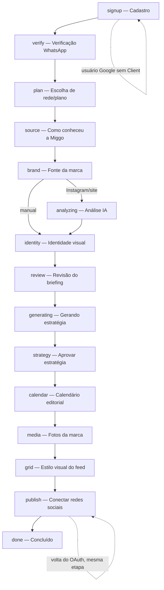

O onboarding é a rota pública `/onboarding` (`src/App.tsx:68`), servida por `src/pages/Onboarding/OnboardingShell.tsx`. É a etapa 1 de criação da própria conta (MIG-109): quem chega sem sessão vê o cadastro (`SignupStep`) direto, sem precisar já ter usuário.

<Note>
`src/pages/Onboarding/Steps/ContentStep.tsx` e `src/pages/Onboarding/Steps/CreatingStep.tsx` existem no diretório mas **não são importados** pelo `OnboardingShell.tsx` — não fazem parte do fluxo ativo (comentário no shell explica: "as telas de 'criando o primeiro conteúdo' e de aprovação do post saíram do fluxo"). Tratados aqui como órfãos, não documentados passo a passo.
</Note>

## O shell — `OnboardingShell.tsx`

Container único de todas as etapas. Responsabilidades:

1. **Busca o estado da sessão** (`fetchState`) via `onboardingApi.getState()` (`GET /onboarding/state/`). Sem token de acesso (`getAccessToken()` nulo), nem chama a API — define `current_step: 'signup'` direto, porque uma chamada autenticada devolveria 401 e o interceptor global redirecionaria para `/signin`.
2. **Decide a etapa a exibir** a partir de `session.current_step`, com duas exceções controladas por query string:
   - `?step=<id>` (entrada pelo dashboard, MIG-168): se `<id>` está em `pending_steps`, chama `onboardingApi.resumeOnboarding(step)` e entra em `resumeMode` — ao concluir essa etapa, chama `completeOnboarding()` e volta para `/` em vez de seguir a esteira.
   - `?continuar=1` (retorno de OAuth de rede social, MIG-196): pula a lógica de retomada automática — voltar de um OAuth é "continuar de onde se estava", não reentrar no fluxo.
   - Sem nenhum dos dois, no **primeiro load**, se `resume_step !== current_step` e `resume_step` está pendente, chama `resumeOnboarding(resume_step)` — cobre o caso de uma etapa anterior ter ficado pendente (ex.: identidade visual adiada) enquanto `current_step` já avançou.
3. **Renderiza a etapa** via `switch(step)` — ver tabela abaixo.
4. **Navegação para trás** (`viewStep`): permite revisitar uma etapa concluída sem alterar o estado no servidor — só as etapas em `NAVIGABLE` (`brand`, `identity`, `review`, `plan`, `source`, `strategy`, `calendar`, `media`, `grid`); as telas de espera (polling) e cadastro/verificação/conclusão não entram.
5. **Barra de progresso** — `stepNumber / steps.length`, usando `session.steps` (vindo do backend) ou `FALLBACK_STEPS` (hardcoded no componente) se o backend ainda não enviou a lista.

### Máquina de passos

<Note>
O diagrama reflete a ordem do `switch` em `OnboardingShell.tsx` e o `FALLBACK_STEPS`. A ordem real por sessão vem de `session.steps`, calculada pelo backend — pode variar (ex.: sessões antigas paradas em `creating`/`content`, tratadas como sinônimo de `done` pelo shell).
</Note>

## Passos, na ordem

| Etapa (`id`) | Arquivo | Navegável (voltar) |
|---|---|---|
| `signup` | `Steps/SignupStep.tsx` | Não |
| `verify` | `Steps/VerifyStep.tsx` | Não |
| `plan` | `Steps/PlanStep.tsx` | Sim |
| `source` | `Steps/SourceStep.tsx` | Sim |
| `brand` | `Steps/BrandSourceStep.tsx` | Sim |
| `analyzing` | `Steps/AnalyzingStep.tsx` | Não (espera com polling) |
| `identity` | `Steps/IdentityStep.tsx` | Sim |
| `review` | `Steps/ReviewStep.tsx` | Sim |
| `generating` | `Steps/GeneratingStep.tsx` | Não (espera com polling) |
| `strategy` | `Steps/StrategyStep.tsx` | Sim |
| `calendar` | `Steps/CalendarStep.tsx` | Sim |
| `media` | `Steps/MediaStep.tsx` | Sim |
| `grid` | `Steps/GridStep.tsx` | Sim |
| `publish` | `Steps/PublishStep.tsx` | Não |
| `done` | `Steps/DoneStep.tsx` | Não |

<AccordionGroup>

<Accordion title="signup — SignupStep.tsx">

Cadastro da conta. Dois modos, decididos por `user` (do `useAuth`):

- **Sem sessão:** formulário completo (nome, sobrenome, WhatsApp com máscara `(11) 99999-9999`, e-mail, senha + confirmação). Validação client-side de senha (mín. 8 caracteres, 1 maiúscula, 1 número — espelha a regra do backend) e indicador de força. Também oferece login Google (`GoogleLogin`, habilitado se `VITE_GOOGLE_CLIENT_ID` estiver setado) via `loginWithGoogle` do `AuthContext`.
  - Envia: `onboardingApi.signup({ name, email, password, confirmPassword, whatsapp })` → `POST /onboarding/signup/`. Se a resposta trouxer `access`, salva tokens (`saveTokensFromResponse`) e recarrega a página (`window.location.reload()`) em vez de chamar `onNext` — o reload reidrata `useAuth` com a nova sessão.
- **Com sessão mas sem Client** (ex.: acabou de logar via Google): pede só nome/sobrenome/WhatsApp.
  - Envia: `onboardingApi.completeSocial({ whatsapp, name })` → `POST /onboarding/signup/complete-social/`.

</Accordion>

<Accordion title="verify — VerifyStep.tsx">

Verificação do WhatsApp por código de 4 dígitos (inputs individuais com auto-avanço/paste). Ao buscar a tela, chama `onboardingApi.getState()` só para exibir o número mascarado (`whatsapp_masked`).

- Código completo dispara `onboardingApi.verifyCode(code)` → `POST /onboarding/verify/` automaticamente (sem botão "confirmar").
- Reenvio com cooldown de 60s: `onboardingApi.resendCode()` → `POST /onboarding/verify/resend/`.
- "Número errado? Alterar número": formulário inline chama `onboardingApi.changeNumber(whatsapp)` → `PATCH /onboarding/verify/change-number/`, reinicia o cooldown e limpa o código digitado.

</Accordion>

<Accordion title="plan — PlanStep.tsx">

MIG-265: a pergunta é sobre **presença digital** (em quais redes o cliente quer estar), não sobre pagamento — os cards não mostram preço nem "7 dias grátis". Dois cards fixos (Instagram / LinkedIn), o cliente marca um ou os dois; a combinação resolve o `Plan`/`PlanPrice` correspondente entre os planos carregados (`onboardingApi.getPlans()` → `GET /subscription/plan/list/`, filtrados aos que têm algum preço `visible`).

- Envia: `onboardingApi.setPlan(planPriceId)` → `POST /onboarding/plan/`. Isso já cria o trial no plano resolvido. Se a resposta trouxer `trial_active: false`, mostra erro em vez de avançar (evita terminar o onboarding sem assinatura, o que travaria em "Acesso Restrito").

</Accordion>

<Accordion title="source — SourceStep.tsx">

"Como você conheceu a Miggo?" — 9 opções fixas (`SOURCES`: Instagram, Google, Indicação, Cliente da Miggo, Evento/palestra, Comunidade, LinkedIn, YouTube, Outro). "Indicação" e "Outro" pedem um campo de detalhe (máx. 150 caracteres, `DETAIL_MAX_LENGTH`, espelha `REFERRAL_MAX_LENGTH` do backend).

- Envia: `onboardingApi.setReferral(referral, detail)` → `POST /onboarding/referral/`. Para "indicação", o valor composto (`"indicacao: <detail>"`) é truncado no limite antes de enviar — o backend só concatena o detail quando `referral === 'outro'`.

</Accordion>

<Accordion title="brand — BrandSourceStep.tsx">

MIG-155/MIG-221. Coleta a(s) fonte(s) da marca: Instagram, Website (ambos, um ou nenhum — modo `manual`). Fluxo em duas fases:

1. **`input`** — campos de Instagram/Website com validação no blur (`onboardingApi.validateProfile(kind, value)` → `POST /onboarding/validate-profile/`, não bloqueante: verdicts `'unknown'` não travam o avanço). No submit, chama `onboardingApi.previewBrandSource({ instagram, website })` → `POST /onboarding/brand-source/preview/`, que devolve um mock do perfil (sem iniciar a análise).
2. **`confirm`** — mostra o preview de cada fonte informada (avatar/bio do Instagram, screenshot/og:image do site) com botão "Confirmar"/"Corrigir" por fonte. Confirmar a **última** fonte pendente já dispara `startAnalysis()`, que chama `onboardingApi.setBrandSource({ instagram, website })` → `POST /onboarding/brand-source/` e avança.

Modo `manual`: `onboardingApi.setBrandSource({ manual: true })` e avança direto (sem fase de confirmação).

"Configurar Depois" (`handleSkip`): `onboardingApi.skipOnboarding(session.client_id)` → `POST /client/onboarding-skip/:clientId/`, e redireciona para `/` fora do fluxo React (marca `Client.onboarding_skipped`, que o `OnboardingGuard` consulta).

</Accordion>

<Accordion title="analyzing — AnalyzingStep.tsx">

Tela de espera com polling (3s) em `onboardingApi.getAnalysisStatus()` → `GET /onboarding/analysis-status/`, que devolve `{ status, steps, current_step_index, error, onboarding_step, notice }`. Mostra os passos reais (até 8) retornados pelo backend, com destaque no atual. Avança (`onNext`, com 1.2s de atraso) quando `status === 'done'` OU `onboarding_step` deixa de estar em `['brand', 'analyzing']`. Em `status === 'failed'`, mostra o erro sem avançar. Sem botão de ação do usuário — 100% automática.

</Accordion>

<Accordion title="identity — IdentityStep.tsx">

Revisão da identidade visual (logo, paleta de cores, tipografia, referências visuais, estilo visual). Ao montar, carrega via `onboardingApi.getReview()` → `GET /onboarding/review/`.

- **Salvar sem avançar:** `onboardingApi.updateReview(data, false, 'identity')` → `PUT /onboarding/review/` com `{ review, advance: false, from_step: 'identity' }`.
- **Continuar:** exige ao menos uma cor válida (regex hex) antes de `updateReview(data, true, 'identity')`.
- **Upload de logo:** `onboardingApi.uploadLogo(file)` → `POST /onboarding/logo/` (`FormData`), recarrega a review em seguida.
- **"Enviar depois" (sem logo):** `onboardingApi.autofillReview(true, true, 'identity')` → `POST /onboarding/review/autofill/` com `{ advance: true, fallback_palette: true, from_step: 'identity' }` — a IA deduz uma paleta provisória para não travar o fluxo; tudo continua editável depois em "Minha Marca".

</Accordion>

<Accordion title="review — ReviewStep.tsx (350 linhas)">

Revisão completa do briefing (dados básicos, público-alvo, tom de voz, produtos, diferenciais, objetivos, CTAs, brand kit). Reaproveita os mesmos componentes de campo da tela de Briefing da plataforma (`src/components/briefing/ReviewFields.tsx` — `Field`, `ListEditor`, `Section`, `TargetPicker`), então o formulário aqui e o de "Minha Marca" têm exatamente os mesmos rótulos e controles.

Ao montar, se a fonte **não** foi `manual` (`session.brand_source !== 'manual'`), chama `onboardingApi.autofillReview(false)` → preenche com IA os campos em branco **sem avançar** (persiste, mas quem decide seguir é o usuário); em falha, cai para `getReview()` puro. Fonte manual nunca chama autofill — a pessoa escolheu preencher sozinha.

- **Autosave (MIG-223):** salva sozinho conforme edita (`advance=false`), sem exigir rolar até o fim e clicar em salvar — evita perder o que já foi digitado.
- **Continuar:** `onboardingApi.updateReview(data, true, 'review')`.

</Accordion>

<Accordion title="generating — GeneratingStep.tsx">

Tela de espera (sem interação) enquanto a estratégia é gerada. Dispara `onboardingApi.generateStrategy()` → `POST /onboarding/strategy/generate/` (falha ao disparar não é fatal — pode já haver uma geração em andamento) e faz polling a cada 3s em `onboardingApi.getStrategy()` → `GET /onboarding/strategy/`, avançando quando `items.length > 0` ou `status === 'done'`. Os 5 rótulos de passo (`GENERATING_STEPS`) são só cosméticos — avançam num ritmo local (`STEP_TICK = 3500ms`), o backend não reporta progresso granular. Teto de espera de 5 minutos (`MAX_WAIT_MS`) antes de oferecer "Tentar novamente"; até 5 falhas de rede seguidas toleradas.

</Accordion>

<Accordion title="strategy — StrategyStep.tsx (531 linhas)">

Revisão e aprovação da estratégia (bio, destaques/capas, visão geral do LinkedIn, banner), agrupada por rede contratada (prefixos `ig-`/`li-`). Aprovação é **única** para todo o conjunto — não item a item.

Ações principais (todas em `onboardingApi`):
- `approveStrategyItem(item_id, approved, content)` → `POST /onboarding/strategy/approve-item/` (salvar edição de um item).
- `regenerateStrategyItem(item_id, feedback)` → `POST /onboarding/strategy/item/regenerate/` (ajuste por IA de **um** item, preserva os demais já aprovados).
- `sendStrategyFeedback(feedback)` → `POST /onboarding/strategy/feedback/` (refaz a estratégia **inteira**).
- `approveStrategy()` → `POST /onboarding/strategy/approve/` (aprovação final, avança para `calendar`).

Inclui download em lote das capas de destaque e lightbox de visualização ampliada.

</Accordion>

<Accordion title="calendar — CalendarStep.tsx (328 linhas)">

Grade semanal proposta pela IA (dia, horário, assunto, formatos — read-only, chips), com catálogo de estilos/CTAs/tags pré-cadastrado (`fetchCalendarCatalog`, `src/services/editorialCalendarCatalog.ts`). MIG-164: a composição da semana (quantos stories/feeds, limite do LinkedIn) é decidida pelo **backend**; o único jeito de mudar é pedir por feedback textual à IA — os formatos não são editáveis diretamente aqui (diferente da tela "Calendário Editorial" da plataforma).

- `onboardingApi.getCalendar()` → `GET /onboarding/calendar/`.
- `updateCalendar(calendar)` → `PUT /onboarding/calendar/` (salva toggle ativo/assunto/horário antes de regerar/aprovar).
- `regenerateCalendar(feedback)` → `POST /onboarding/calendar/regenerate/`.
- `approveCalendar()` → `POST /onboarding/calendar/approve/`.

</Accordion>

<Accordion title="media — MediaStep.tsx">

Upload das fotos reais da marca — alimenta a **mesma** biblioteca "Minhas fotos" da plataforma (é dela que o agente de IA tira imagens reais para os posts). Não bloqueia o onboarding.

- `onboardingApi.getMedia()` → `GET /onboarding/media/` (devolve `media` + `limits`: `max_image_mb`, `max_video_mb`, e no trial gratuito `free_trial`+`max_files`).
- Validação client-side (tamanho por arquivo, contagem total no trial) antes de `onboardingApi.uploadMedia(files)` → `POST /onboarding/media/` (`FormData`).
- `deleteMedia(id)` → `DELETE /onboarding/media/?media_id=:id`.
- **"Enviar depois":** `onboardingApi.continueMedia(defer: true)` → `POST /onboarding/media/continue/` com `{ defer: true }` — registra a escolha e avança sem exigir fotos.

</Accordion>

<Accordion title="grid — GridStep.tsx">

MIG-165/Sprint 6 TASK-12: a etapa virou **escolha de referência**, não geração na hora. Mostra 3 estilos pré-cadastrados (`onboardingApi.getGridStyles(refresh)` → `GET /onboarding/grid/styles/`, com `refresh=true` para descartar os já mostrados e pedir outros). Ao escolher:

1. `onboardingApi.selectGridStyle(reference_id)` → `POST /onboarding/grid/styles/` com `{ reference_id }`.
2. `onboardingApi.approveGrid()` → `POST /onboarding/grid/approve/` (conclui a etapa e dispara a geração do 1º conteúdo em background).
3. `onNext()`.

Não há preview nem tela de loading aqui — a geração da imagem personalizada (grid com cores/logo da marca) roda depois por cron, e o cliente é avisado por WhatsApp/notificação (ver `GridApprovalPage` em `paginas.mdx`, tela separada acessada por link).

</Accordion>

<Accordion title="publish — PublishStep.tsx">

Conexão real de redes sociais, reaproveitando o componente `SocialConnections` (mesmo das Configurações), com props `clientId`, `isOnboarding` e `onConnectionsChange`. MIG-185: conectar **uma** rede não encerra a etapa — a volta do OAuth cai de novo aqui (via `SocialConnected`, ver abaixo), com a conta recém-ligada já marcada, para conectar outras redes propostas se quiser.

- Botão principal ("Continuar") e secundário ("Pular as outras conexões" / "Fazer depois", rótulo muda conforme já há conexão) chamam o **mesmo** handler: `onboardingApi.completeOnboarding()` → `POST /onboarding/complete/`, seguido de `onNext()`.

</Accordion>

<Accordion title="done — DoneStep.tsx">

Tela final. Busca `onboardingApi.getSummary()` → `GET /onboarding/summary/` para mostrar os próximos conteúdos previstos (data, formato, horário). Checklist fixo (estratégia criada, calendário configurado, primeiros conteúdos em produção — sempre `done: true`, não reflete estado real por item). Destaca que o estilo visual e os primeiros conteúdos chegam depois, por WhatsApp.

Botão "Ir para a plataforma" chama `onFinish` (prop do shell = `handleFinish`): `onboardingApi.completeOnboarding()` → `POST /onboarding/complete/`, depois `clearOnboardingCache()` e `navigate('/')`.

</Accordion>

<Accordion title="SocialConnected.tsx — retorno do OAuth dentro do onboarding">

Não é um "passo" da esteira (`current_step` nunca vale isso) — é a rota `/onboarding/conectado/:platform/:clientId/*` (`src/App.tsx:87`), destino do OAuth quando a conexão parte do onboarding (`origin=onboarding` gravado no `connection_url` da integração). Existe porque a tela de sucesso genérica (`InstagramSuccess`, ver `paginas.mdx`) manda de volta para `/profile` — dentro da esteira a conexão é a própria etapa, não um desvio.

Fluxo: `clearOnboardingCache()` → confirma a integração junto ao Zernio (`GET /api/v1/post/platform-integration/list/?client=:clientId`, força reconciliação sem depender do webhook `account.connected`) → `onboardingApi.getState()` para ler `current_step`:
- `'publish'` → `navigate('/onboarding?continuar=1')` (volta para a etapa de conexão, deixando a pessoa decidir se conecta mais redes).
- outra etapa pendente → mesmo destino (`?continuar=1`).
- `'done'`/sem sessão → `navigate('/app/profile')`.

</Accordion>

</AccordionGroup>

## `useOnboarding` — status de conclusão (usado fora do shell)

**Arquivo:** `src/hooks/useOnboarding.ts`

Hook consumido pelas telas da plataforma (Dashboard, Content, Brandkit, Agenda, etc. — ver `paginas.mdx`) para saber se um cliente pode usar o recurso. Busca `GET /api/v1/client/onboarding-status/:clientId/`, com **cache em memória module-level** (`_cachedStatus`/`_cachedClientId`, não React state) para evitar corrida entre `OnboardingGuard` e o próprio fluxo ao navegar logo após concluir.

Campos principais de `OnboardingStatus`:
| Campo | Uso |
|---|---|
| `is_onboarding_complete` | Gate real de acesso ao app (usado pelo `OnboardingGuard`) — pode ser `true` no meio da esteira (o trial nasce na etapa do plano; etapas finais são opcionais). |
| `onboarding_current_step` | Etapa onde a pessoa parou (`'publish'`, `'done'`, `null` para clientes sem sessão). **Não confundir** com `is_onboarding_complete`. |
| `pending_steps` | Etapas sem preenchimento efetivo, na ordem do fluxo — alimenta os "chips" do dashboard. |
| `grid_reference_chosen` | Se a referência de grid já foi escolhida (separa escolha, no onboarding, de aprovação do mosaico, na `GridApprovalPage`). |
| `onboarding_skipped` | Setado por `skipOnboarding` (o "Configurar Depois" do `BrandSourceStep`). |

Deriva `isInOnboardingFlow = !!onboarding_current_step && onboarding_current_step !== 'done'` — usado (ex.: em `InstagramSuccess.tsx`) para decidir se o retorno de um OAuth deve emendar de volta no onboarding ou seguir para a plataforma normal. `clearOnboardingCache()` é exportado e chamado sempre que uma ação pode ter mudado o status (aprovação de grid, conclusão, conexão social) para forçar releitura.

## Retomada de onboarding incompleto

Dois caminhos distintos, ambos em `onboardingApi.resumeOnboarding(step?)` → `POST /onboarding/resume/`:

1. **Chip do dashboard** (`/onboarding?step=<id>`): reabre exatamente aquela etapa; ao concluí-la, `resumeMode` faz o shell chamar `completeOnboarding()` e voltar para `/` — não empurra pelo resto da esteira.
2. **Entrada crua em `/onboarding`** (sem `step`, sem `?continuar=1`, só no primeiro load): segue `resume_step` do servidor quando ele difere de `current_step` e está em `pending_steps` — cobre etapa que ficou pra trás (ex.: confirmação de briefing adiada) sem reiniciar o fluxo a cada avanço subsequente.

Tentar retomar uma etapa **já concluída** (via chip) devolve 400 do backend — não é uma porta para reescrever o que já foi aprovado.

## Condição de conclusão

`onboarding_completed`/`is_onboarding_complete` (Sprint 6 / TASK-06) vêm da `OnboardingSession` no backend, não do contador legado `onboarding_step`. O onboarding é considerado "completo o bastante para liberar o app" bem antes do fim literal da esteira (o trial já nasce na etapa `plan`) — chegar a `current_step === 'done'` não é o mesmo que não ter pendências: quem adiou fotos, grid ou estratégia chega em `done` mesmo assim, e essas pendências continuam aparecendo como `pending_steps` no dashboard.
