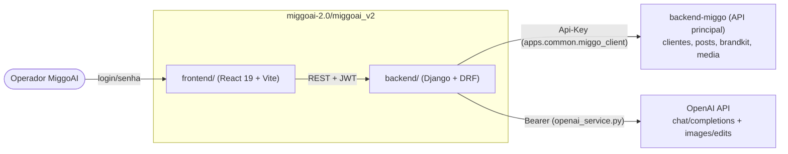
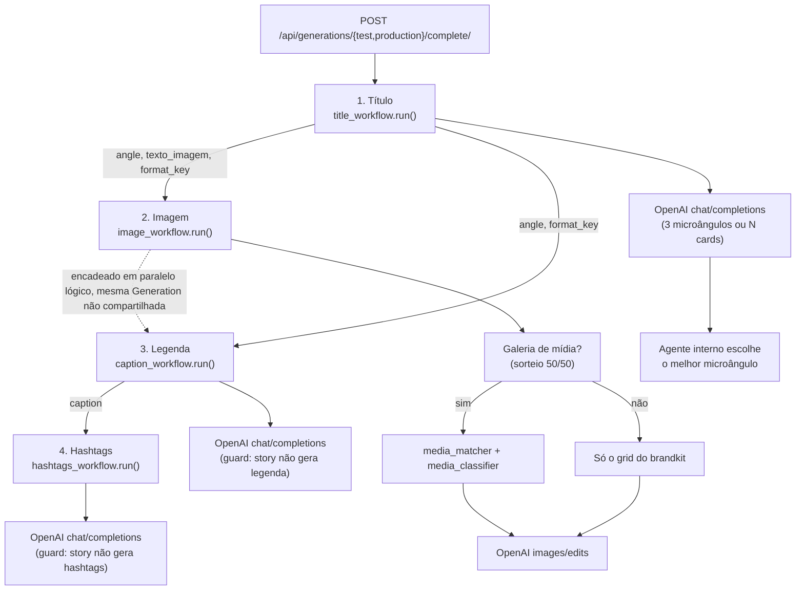

## Visão geral

O MiggoAI é um **serviço interno auxiliar** ao `backend-miggo` (a plataforma principal da Miggo). Ele não tem modelo próprio de clientes/posts — consome esses dados ao vivo, via HTTP, direto do `backend-miggo`, e devolve conteúdo gerado por IA (título, imagem, legenda, hashtags) que o operador aplica ao post.



- **`frontend/`** fala apenas com o **backend do próprio MiggoAI** (`VITE_API_BASE_URL`), autenticado via JWT (SimpleJWT). Nunca chama o `backend-miggo` ou a OpenAI diretamente.
- **`backend/`** fala com o `backend-miggo` (autenticado por API Key, header `Authorization: Api-Key <chave>`, ver `apps/common/miggo_client.py:19-23`) e com a OpenAI (autenticado por Bearer token, `apps/generations/services/openai_service.py:55-59`).
- Não existe sincronização/cache de clientes ou posts no MiggoAI — cada geração busca os dados ao vivo (exceto o histórico de posts do dia, cacheado em `ClientPostHistory` — ver abaixo).

## Relação com os dados do backend-miggo

Os únicos dados que o `backend-miggo` expõe e o MiggoAI consome:

| Recurso (backend-miggo) | Endpoint consumido | Módulo/serviço MiggoAI |
|---|---|---|
| Clientes | `client/list/` | `apps.clients.services.list_clients` / `get_client_detail` |
| Briefing (client-meta) | `client/client-meta/list/` | `apps.clients.services.get_briefing` |
| Grid 3x3 (brandkit) | `brandkit/grid/list/` | `apps.clients.services.get_client_grid` |
| Logo (brandkit) | `brandkit/list/`, `brandkit/logo/list/` | `apps.clients.services.get_client_logo` |
| Galeria de mídia | `media/list/` | `apps.clients.services.get_client_media_library` |
| Preferência de assinatura | `client/signature-preference/<id>/` | `apps.clients.services.get_signature_preference` |
| Posts (cards) | `post/list/`, `post/detail/<id>/` | `apps.posts.services.list_posts` / `get_post_detail` |
| Formatos de post | `post/format/list/` | `apps.posts.services.get_post_formats` |
| Status de post | `post/status/list/` | `apps.posts.services.get_post_statuses` |

O único dado do `backend-miggo` que o MiggoAI **persiste** localmente é um retrato diário do histórico de posts (`ClientPostHistory`, um registro por cliente/dia — `apps/clients/models.py:26-51`), para não repetir 3 chamadas HTTP a cada geração do mesmo dia. Respostas de variáveis de prompt fornecidas manualmente pelo operador também ficam salvas localmente (`ClientVariableValue`), reaproveitadas nas próximas gerações do mesmo cliente.

## Árvore de diretórios comentada

```text
miggoai-2.0/miggoai_v2/
├── backend/                        # API Django/DRF em produção
│   ├── core/                       # settings, urls, wsgi/asgi
│   ├── apps/
│   │   ├── clients/                # proxy de clientes + ClientVariableValue/ClientPostHistory
│   │   ├── posts/                  # proxy de posts/formatos/status
│   │   ├── prompts/                # CMS de prompts (Workflow, PromptDefinition, versões, variáveis)
│   │   ├── generations/            # execução dos workflows de IA + Generation (auditoria)
│   │   │   └── services/
│   │   │       ├── runner.py           # ponto único de execução (cria/fecha a Generation)
│   │   │       ├── context_builder.py  # monta o contexto (cliente/post/histórico/calendário)
│   │   │       ├── output_contract.py  # schema JSON + instrução fixa por tipo de saída
│   │   │       ├── openai_service.py   # cliente OpenAI (chat + geração de imagem)
│   │   │       ├── title_workflow.py, image_workflow.py, caption_workflow.py, hashtags_workflow.py
│   │   │       ├── media_matcher.py    # peneira léxica da galeria de mídia
│   │   │       └── media_classifier.py # julgamento por IA de qual foto usar
│   │   └── common/                 # apps.common.miggo_client — cliente HTTP base para o backend-miggo
│   └── manage.py
├── frontend/                       # SPA React 19 + Vite (painel do MiggoAI)
│   └── src/{pages,components,context,services,types}
├── modules/                        # PROTÓTIPO original dos workflows (histórico, ver nota abaixo)
│   ├── miggo.py                    # 1ª versão do cliente HTTP do backend-miggo
│   ├── openai.py                   # 1ª versão do cliente OpenAI
│   └── workflow.py                 # 1ª versão dos workflows encadeados
├── main.py                         # CLI interativa que roda modules/workflow.py
├── requirements.txt                # deps só de modules/ e main.py (requests, Pillow, python-dotenv)
├── Dockerfile.backend / Dockerfile.frontend
└── docs internos (.env.example, etc.)
```

<Warning>
  `modules/` e `main.py` são o **protótipo** que validou o fluxo de geração antes de ele ser portado para dentro do
  Django (`backend/apps/generations/services/`). O código é muito parecido propositalmente — comentários no próprio
  backend citam isso (`backend/apps/generations/services/openai_service.py:1-5`: "porte direto da lógica já validada
  em `modules/openai.py`"). Hoje a versão que roda em produção/no frontend é a do `backend/`; `modules/`+`main.py`
  seguem funcionais mas são standalone (não usam Django, não persistem `Generation`, não passam pelo CMS de prompts).
</Warning>

## Fluxo de geração (título → imagem → legenda → hashtags)

O fluxo completo é orquestrado por `run_complete` (`backend/apps/generations/services/runner.py:167-215`), que encadeia 4 execuções independentes de `run_workflow`, cada uma virando seu próprio registro `Generation`:



Pontos-chave do encadeamento (`runner.py:167-215`):

1. **Título** roda primeiro e sempre decide o `format_key` (story/feed/carrossel/reel) — por sorteio entre os formatos sugeridos do calendário editorial, ou herdado do card se já definido manualmente (`context_builder._escolher_formato`, `backend/apps/generations/services/context_builder.py:212-248`).
2. O `format_key` e o `angle`/texto escolhidos no título são repassados como `variable_overrides` para os 3 passos seguintes — nunca persistidos como preferência do cliente (`_CHAIN_ONLY_KEYS`, `runner.py:31-40`), para não vazar o texto de um post específico para gerações futuras.
3. Se um passo falha, a cadeia para ali; os passos já concluídos continuam salvos e são devolvidos ao frontend.
4. **Imagem** não depende do texto de legenda/hashtags — roda em paralelo lógico à legenda (mesma entrada: título + formato).
5. **Hashtags** depende do texto da legenda gerada no passo 3.

Cada ambiente (`TEST`/`PRODUCTION`) grava as imagens em subpastas separadas dentro de `MEDIA_ROOT` (`_image_dir`, `runner.py:49-51`), e generations de `TEST` podem ser apagadas manualmente ou por rotina de limpeza (`cleanup_test_generations`, ver <a href="/miggoai/workflows">Workflows</a>).

<Columns cols={2}>
  <Card title="Referência de API" icon="plug" href="/miggoai/api-referencia">Todos os endpoints do backend.</Card>
  <Card title="Workflows" icon="diagram-project" href="/miggoai/workflows">Cada função de geração em detalhe.</Card>
</Columns>
