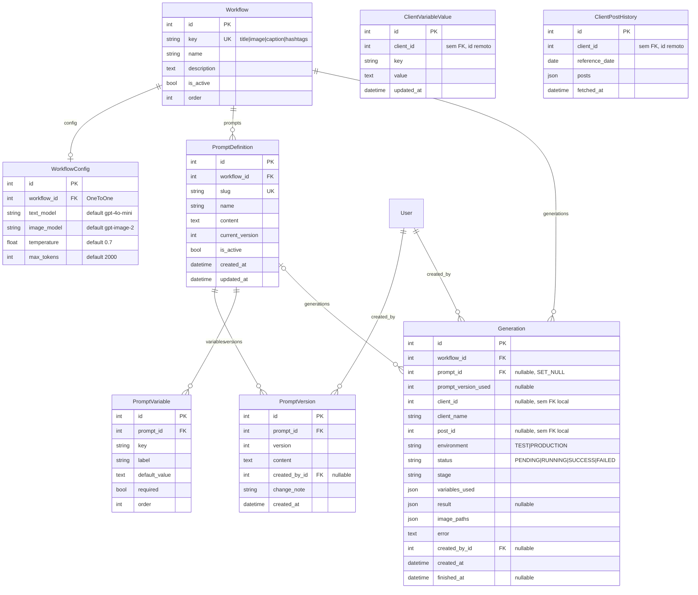

<Note>
  O MiggoAI não tem model local de `Client` nem `Post` — esses dados vivem só no `backend-miggo` e são consumidos ao
  vivo (ver <a href="/miggoai/arquitetura">Arquitetura</a>). Os models abaixo cobrem apenas o que o MiggoAI persiste
  localmente: preferências de variável, retrato de histórico, prompts/workflows e o registro de auditoria das gerações.
</Note>

## Diagrama

## `apps.clients`

Fonte: `backend/apps/clients/models.py`.

### `ClientVariableValue`

Resposta de uma variável de prompt já fornecida para um cliente (override manual salvo de uma geração anterior), reaproveitada automaticamente nas próximas gerações desse cliente pelo `runner` (`models.py:4-23`).

| Campo | Tipo | Detalhe |
|---|---|---|
| `client_id` | `PositiveIntegerField` | Indexado. Id do cliente no backend-miggo — sem FK local (o `Client` não existe como model neste projeto). |
| `key` | `CharField(60)` | Chave da variável (ex.: `tone_of_voice`). |
| `value` | `TextField` | Valor salvo, pode ser vazio. |
| `updated_at` | `DateTimeField` | `auto_now=True`. |

**Meta**: `unique_together = ('client_id', 'key')`; `ordering = ['key']`.

### `ClientPostHistory`

Retrato do histórico de posts do cliente para um dia — evita repetir 3 chamadas HTTP ao backend-miggo a cada geração do mesmo dia (`models.py:26-51`).

| Campo | Tipo | Detalhe |
|---|---|---|
| `client_id` | `PositiveIntegerField` | Indexado. |
| `reference_date` | `DateField` | Dia a que o retrato se refere. |
| `posts` | `JSONField` | Lista de posts, já deduplicados e ordenados (`default=list`). |
| `fetched_at` | `DateTimeField` | `auto_now_add=True`. |

**Meta**: `unique_together = ('client_id', 'reference_date')`; `ordering = ['-reference_date']`; `verbose_name_plural = 'client post histories'`.

## `apps.posts`

`backend/apps/posts/models.py:1-3` — arquivo sem nenhum model definido (`# Create your models here.`, sem código abaixo). O app é puramente um proxy HTTP (`apps/posts/services.py`), sem persistência local.

## `apps.prompts`

Fonte: `backend/apps/prompts/models.py`.

### `Workflow`

Um dos 4 tipos de geração de conteúdo.

| Campo | Tipo | Detalhe |
|---|---|---|
| `key` | `CharField(30)`, choices | Único. Choices: `title` ("Título"), `image` ("Imagem"), `caption` ("Legenda"), `hashtags` ("Hashtags") — constantes `KEY_TITLE`/`KEY_IMAGE`/`KEY_CAPTION`/`KEY_HASHTAGS`. |
| `name` | `CharField(100)` | Nome de exibição. |
| `description` | `TextField` | Opcional. |
| `is_active` | `BooleanField` | Default `True`. |
| `order` | `PositiveSmallIntegerField` | Default `0`, usado para ordenação na UI. |

**Meta**: `ordering = ['order', 'id']`.

### `WorkflowConfig`

Configuração de modelo de IA por workflow.

| Campo | Tipo | Detalhe |
|---|---|---|
| `workflow` | `OneToOneField(Workflow)` | `on_delete=CASCADE`, `related_name='config'`. |
| `text_model` | `CharField(60)` | Default `'gpt-4o-mini'`. |
| `image_model` | `CharField(60)` | Default `'gpt-image-2'`. |
| `temperature` | `FloatField` | Default `0.7`. |
| `max_tokens` | `PositiveIntegerField` | Default `2000`. |

### `PromptDefinition`

Um template de prompt editável, vinculado a um `Workflow`.

| Campo | Tipo | Detalhe |
|---|---|---|
| `workflow` | `ForeignKey(Workflow)` | `on_delete=CASCADE`, `related_name='prompts'`. |
| `slug` | `SlugField(80)` | Único (ex.: `titulo-story`, `imagem-post`, `legenda-post`, `hashtags-post`). |
| `name` | `CharField(150)` | Nome de exibição. |
| `content` | `TextField` | Template com `{{variavel}}`. |
| `current_version` | `PositiveIntegerField` | Default `1`, incrementado a cada mudança de `content` via `PUT`. |
| `is_active` | `BooleanField` | Default `True` — só prompts ativos são usados nos workflows (`PromptDefinition.objects.get(slug=..., is_active=True)`). |
| `created_at` / `updated_at` | `DateTimeField` | `auto_now_add` / `auto_now`. |

**Meta**: `ordering = ['workflow__order', 'name']`.

### `PromptVersion`

Snapshot do conteúdo anterior de um prompt, criado a cada edição de `content`.

| Campo | Tipo | Detalhe |
|---|---|---|
| `prompt` | `ForeignKey(PromptDefinition)` | `on_delete=CASCADE`, `related_name='versions'`. |
| `version` | `PositiveIntegerField` | Número da versão salva. |
| `content` | `TextField` | Conteúdo daquela versão. |
| `created_by` | `ForeignKey(AUTH_USER_MODEL)` | `null=True, blank=True`, `on_delete=SET_NULL`. |
| `change_note` | `CharField(255)` | Opcional. |
| `created_at` | `DateTimeField` | `auto_now_add=True`. |

**Meta**: `ordering = ['-version']`; `unique_together = ('prompt', 'version')`.

### `PromptVariable`

Variável declarada para um prompt (documentação/validação de `{{chave}}`).

| Campo | Tipo | Detalhe |
|---|---|---|
| `prompt` | `ForeignKey(PromptDefinition)` | `on_delete=CASCADE`, `related_name='variables'`. |
| `key` | `CharField(60)` | Chave usada no template. |
| `label` | `CharField(150)` | Rótulo legível. |
| `default_value` | `TextField` | Opcional. |
| `required` | `BooleanField` | Default `False` — se `True`, ausência/vazio levanta `MissingVariableError` na renderização. |
| `order` | `PositiveSmallIntegerField` | Default `0`. |

**Meta**: `ordering = ['order', 'id']`; `unique_together = ('prompt', 'key')`.

## `apps.generations`

Fonte: `backend/apps/generations/models.py`.

### `Generation`

Registro de auditoria de cada execução de workflow — criado como `RUNNING` e sempre fechado como `SUCCESS`/`FAILED` pelo `runner` (ver <a href="/miggoai/workflows">Workflows</a>).

| Campo | Tipo | Detalhe |
|---|---|---|
| `workflow` | `ForeignKey(Workflow)` | `on_delete=PROTECT`, `related_name='generations'`. |
| `prompt` | `ForeignKey(PromptDefinition)` | `null=True, blank=True`, `on_delete=SET_NULL`, `related_name='generations'`. |
| `prompt_version_used` | `PositiveIntegerField` | `null=True, blank=True` — versão do prompt no momento da geração. |
| `client_id` | `PositiveIntegerField` | `null=True, blank=True` — sem FK (cliente vive só no backend-miggo). |
| `client_name` | `CharField(255)` | Snapshot legível, para auditoria sem precisar consultar o backend-miggo de novo. |
| `post_id` | `PositiveIntegerField` | `null=True, blank=True` — sem FK. |
| `environment` | `CharField(12)`, choices | `TEST` ("Teste") ou `PRODUCTION` ("Produção"). |
| `status` | `CharField(10)`, choices, default `PENDING` | `PENDING`, `RUNNING`, `SUCCESS`, `FAILED`. |
| `stage` | `CharField(255)` | Estágio textual atualizado ao vivo durante a execução (ex.: "Gerando imagem 2/3"), para polling do frontend. |
| `variables_used` | `JSONField` | `default=dict` — overrides enviados na chamada. |
| `result` | `JSONField` | `null=True, blank=True` — saída do workflow (estrutura varia por tipo, ver <a href="/miggoai/workflows">Workflows</a>). |
| `image_paths` | `JSONField` | `default=list` — caminhos relativos em `MEDIA_ROOT`. |
| `error` | `TextField` | Mensagem de erro se `FAILED`. |
| `created_by` | `ForeignKey(AUTH_USER_MODEL)` | `null=True, blank=True`, `on_delete=SET_NULL`, `related_name='+'`. |
| `created_at` | `DateTimeField` | `auto_now_add=True`. |
| `finished_at` | `DateTimeField` | `null=True, blank=True`. |

**Meta**: `ordering = ['-created_at']`.

**Constantes de classe**: `Generation.ENV_TEST`, `Generation.ENV_PRODUCTION`, `Generation.STATUS_PENDING/RUNNING/SUCCESS/FAILED`.

## Migrations existentes

| App | Migrations |
|---|---|
| `clients` | `0001_initial`, `0002_clientposthistory`, `0003_remove_volatile_variable_values` |
| `prompts` | `0001_initial` |
| `generations` | `0001_initial`, `0002_generation_stage` |
| `posts` | (nenhuma — sem models) |

<Columns cols={2}>
  <Card title="Prompts" icon="file-code" href="/miggoai/prompts">Como os prompts são versionados e renderizados.</Card>
  <Card title="Workflows" icon="diagram-project" href="/miggoai/workflows">Como `Generation` é preenchida.</Card>
</Columns>
